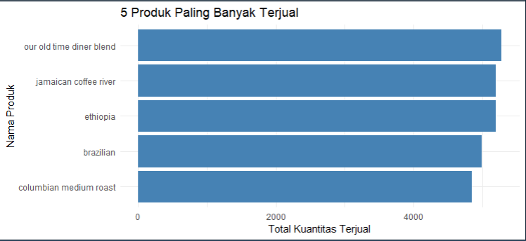
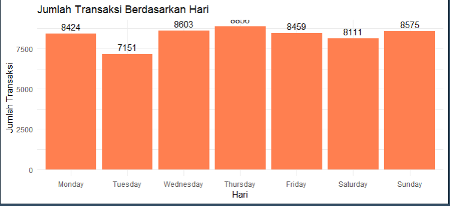
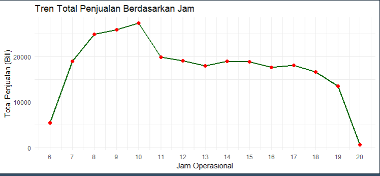
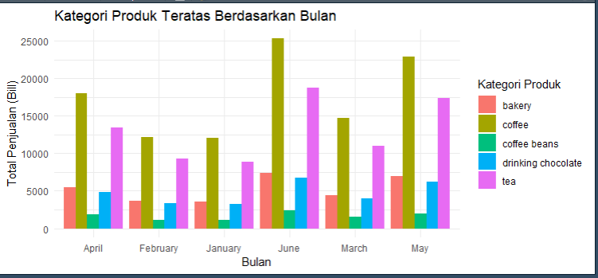

# ☕ Coffee Shop Sales Analysis & Visualization

Proyek ini merupakan bagian dari mini course **"Revou"**, yang bertujuan untuk membantu sebuah coffee shop memantau penjualan harian mereka guna mendukung perencanaan produksi, inventori, dan strategi pemasaran. Analisis dilakukan menggunakan **R** (`dplyr`, `ggplot2`) untuk mengolah data dan membuat visualisasi yang menjawab pertanyaan bisnis utama.

---

## 📋 Deskripsi Proyek

Dataset berisi transaksi penjualan sebuah coffee shop yang mencakup informasi produk, harga, waktu transaksi, dan lokasi toko. Tugas utama adalah mengeksplorasi data tersebut untuk menjawab pertanyaan-pertanyaan bisnis yang relevan bagi pemilik toko, kemudian menyajikannya dalam bentuk chart yang mudah dipahami.

---

## 📂 Struktur Data

Dataset hasil cleaning (`hasil_dataCleaning.csv`) memiliki kolom-kolom berikut:

| Kolom | Deskripsi |
|---|---|
| `transaction_id` | ID unik untuk setiap transaksi |
| `transaction_date` | Tanggal transaksi |
| `transaction_time` | Waktu transaksi |
| `store_id` | ID unik toko |
| `store_location` | Lokasi toko |
| `product_id` | ID unik produk yang terjual |
| `transaction_qty` | Jumlah unit produk yang terjual dalam transaksi |
| `unit_price` | Harga per unit produk (USD) |
| `total_bill` | Total pembayaran (`transaction_qty * unit_price`) |
| `product_category` | Kategori produk (mis. beverage, food) |
| `product_type` | Tipe produk (mis. coffee, pastry) |
| `product_detail` | Deskripsi detail produk |
| `size` | Ukuran produk (small, medium, large) |
| `month_name` | Nama bulan transaksi |
| `day_name` | Nama hari transaksi |
| `hour` | Jam transaksi |
| `month` | Representasi numerik bulan |
| `day_of_week` | Representasi numerik hari dalam seminggu |

---

## ❓ Pertanyaan yang Dijawab

1. **Apa 5 produk (`product_detail`) yang paling banyak terjual berdasarkan kuantitas?**
2. **Hari apa yang paling sibuk bagi coffee shop berdasarkan jumlah transaksi?**
3. **Jam berapa yang memiliki total penjualan (`total_bill`) tertinggi?**
4. **Apa 5 kategori produk teratas berdasarkan penjualan (`total_bill`) untuk setiap bulan transaksi?**

---

## 🛠️ Tools yang Digunakan

- **R** — bahasa pemrograman utama untuk analisis
- **dplyr** — manipulasi dan agregasi data
- **readr** — membaca file CSV
- **ggplot2** — pembuatan visualisasi data

---

## 🔍 Metodologi & Hasil

### 1. Lima Produk Paling Banyak Terjual (Kuantitas)
Data dikelompokkan berdasarkan `product_detail`, kemudian `transaction_qty` dijumlahkan, diurutkan menurun, dan diambil 5 teratas.

**Hasil:** *Our Old Time Diner Blend*, *Jamaican Coffee River*, *Ethiopia*, *Brazilian*, dan *Columbian Medium Roast* menjadi produk dengan kuantitas penjualan tertinggi.



### 2. Hari Paling Sibuk (Jumlah Transaksi)
Data dikelompokkan berdasarkan `day_name`, lalu dihitung jumlah `transaction_id` unik (lebih akurat dibanding menghitung baris data, karena satu transaksi bisa berisi beberapa produk).

**Hasil:** **Thursday** merupakan hari tersibuk dengan jumlah transaksi tertinggi, diikuti Wednesday dan Sunday. Tuesday merupakan hari dengan transaksi paling sedikit.



### 3. Jam dengan Penjualan Tertinggi (Total Bill)
Data dikelompokkan berdasarkan `hour`, `total_bill` dijumlahkan, kemudian diurutkan untuk menemukan jam puncak.

**Hasil:** Penjualan memuncak pada pukul **10 pagi**, dengan tren naik sejak toko buka (jam 6) dan menurun signifikan setelah jam 10 hingga toko tutup (jam 20).



### 4. Lima Kategori Produk Teratas per Bulan (Total Bill)
Data dikelompokkan berdasarkan `month_name` dan `product_category`, dijumlahkan `total_bill`-nya, lalu diambil 5 kategori teratas untuk setiap bulan.

**Hasil:** Kategori **coffee** secara konsisten mendominasi penjualan di hampir semua bulan, dengan **tea** dan **bakery** sebagai kategori pendukung terbesar berikutnya.



---

## 💻 Script Analisis (R)

```r
library(dplyr)
library(readr)
library(ggplot2)

df_cleaned <- read.csv("hasil_dataCleaning.csv")
View(df_cleaned)

# a) 5 Produk Paling Banyak Terjual (Kuantitas)
top_5_products <- df_cleaned %>% 
  group_by(product_detail) %>%
  summarise(total_quantity = sum(transaction_qty, na.rm = TRUE)) %>%
  arrange(desc(total_quantity)) %>%
  head(5)
print(top_5_products)

# b) Hari Paling Sibuk (Jumlah Transaksi)
busiest_day <- df_cleaned %>% 
  group_by(day_name) %>%
  summarise(transaction_count = n_distinct(transaction_id)) %>%
  arrange(desc(transaction_count))
print(busiest_day)

# c) Jam Penjualan Tertinggi (Total Bill)
peak_hour <- df_cleaned %>%
  group_by(hour) %>%
  summarise(total_sales = sum(total_bill, na.rm = TRUE)) %>%
  arrange(desc(total_sales))
head(peak_hour, 1)

# d) 5 Kategori Produk Teratas Tiap Bulan (Total Bill)
top_categories_per_month <- df_cleaned %>%
  group_by(month_name, product_category) %>%
  summarise(total_sales = sum(total_bill, na.rm = TRUE), .groups = 'drop') %>%
  group_by(month_name) %>%
  arrange(month_name, desc(total_sales)) %>%
  slice_head(n = 5)
print(top_categories_per_month)

#-------------------- VISUALISASI --------------------

# Plot a) 5 Produk Teratas
ggplot(top_5_products, aes(x = reorder(product_detail, total_quantity), y = total_quantity)) +
  geom_col(fill = "steelblue") +
  coord_flip() +
  labs(title = "5 Produk Paling Banyak Terjual",
       x = "Nama Produk",
       y = "Total Kuantitas Terjual") +
  theme_minimal()

# Plot b) Hari Paling Sibuk
busiest_day$day_name <- factor(busiest_day$day_name, 
                               levels = c("Monday", "Tuesday", "Wednesday", 
                                          "Thursday", "Friday", "Saturday", "Sunday"))
ggplot(busiest_day, aes(x = day_name, y = transaction_count)) +
  geom_col(fill = "coral") +
  geom_text(aes(label = transaction_count), vjust = -0.5) +
  labs(title = "Jumlah Transaksi Berdasarkan Hari",
       x = "Hari",
       y = "Jumlah Transaksi") +
  theme_minimal()

# Plot c) Jam Puncak
ggplot(peak_hour, aes(x = hour, y = total_sales)) +
  geom_line(color = "darkgreen", size = 1) +
  geom_point(color = "red", size = 2) +
  scale_x_continuous(breaks = min(peak_hour$hour):max(peak_hour$hour)) +
  labs(title = "Tren Total Penjualan Berdasarkan Jam",
       x = "Jam Operasional",
       y = "Total Penjualan (Bill)") +
  theme_minimal()

# Plot d) Kategori Teratas per Bulan
ggplot(top_categories_per_month, aes(x = month_name, y = total_sales, fill = product_category)) +
  geom_col(position = "dodge") + 
  labs(title = "Kategori Produk Teratas Berdasarkan Bulan",
       x = "Bulan",
       y = "Total Penjualan (Bill)",
       fill = "Kategori Produk") +
  theme_minimal()
```

---

## 📌 Insight Utama untuk Bisnis

- **Produksi**: Fokuskan stok pada 5 produk terlaris seperti *Old Time Diner Blend* dan *Jamaican Coffee River* untuk menghindari kehabisan stok.
- **Operasional**: Pastikan staf dan bahan baku siap penuh menjelang jam sibuk (sekitar pukul 8–10 pagi) dan pada hari Kamis, Rabu, dan Minggu.
- **Marketing**: Kategori **coffee** adalah kontributor pendapatan terbesar sepanjang tahun — strategi promosi bundling dengan kategori pendukung (tea, bakery) berpotensi meningkatkan average order value.

---

## ✍️ Author

[Dzikrina Jauza Hasna] Data Analyst | E-Commerce & Customer Analytics 📧 [dzikrinajauza@example.com] · 🔗 https://www.linkedin.com/in/dzikrinajauza/ ·
